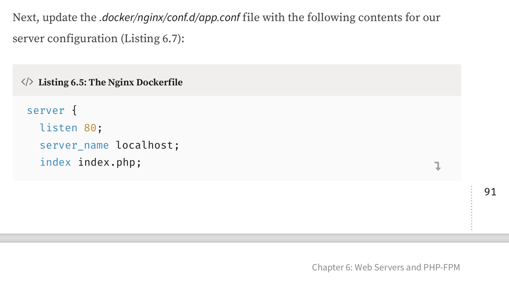
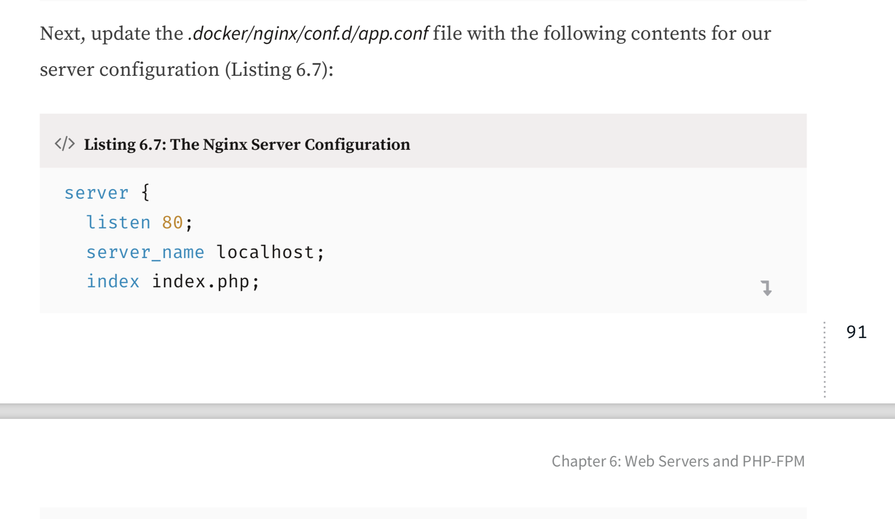

# Docker for PHP Developers Errata (v1)

__Note: Errata reported in this document have been fixed in the latest version of the book. Download the latest from Gumroad or Leanpub depending on where you purchased the book.__

Issue map:

| Icon      | Description                                            |
|-----------|--------------------------------------------------------|
| :bug:     | This code doesn't work properly and/or has a bug in it |
| :warning: | This isn't errata that breaks code listings, but perhaps is either confusing, grammatically incorrect, or has some other minor error or issue.     |
| :no_entry_sign: | Errors, incorrect information, invalid statements |
| 🕐  | Out of date information, no longer valid

## Chapter 2: PHP Container Basics

:warning: On Page `19` of the "fancy" PDF version, the text leading up to `Listing 2.13` has a grammatical error:

__Original Text:__

> We can now copy our php.ini file into the image at the correct path listed in the php --ini command by adding a COPY instruction in the DO (Listing 2.13)

__Correction:__

We can now copy our php.ini file into the image at the correct path listed in the php --ini command by adding a COPY instruction in the ~~~DO~~~ Dockerfile (Listing 2.13).


## Chapter 3: LAMP Baby!

### :warning: Page 26 & 27 - Confusing Example `RUN` Commands

Starting on Page 26 and ending near the top of page 27, the book shows an example of combining multiple commands into one `RUN` instruction, but the `cp` path might confuse users. Instead of the file being at the path `/srv/`, it should be `/srv/app/`.

__Book Contents:__

```bash
# Valid but creates separate layers
RUN cp /srv/.env.example /srv/.env
RUN touch /tmp/foo

# Combines commands into one RUN instruction
RUN cp /srv/.env.example /srv/.env \
    && touch /tmp/foo
```

__Correction:__

```diff
# Valid but creates separate layers
+RUN cp /srv/app/.env.example /srv/app/.env
RUN touch /tmp/foo

# Combines commands into one RUN instruction
+RUN cp /srv/app/.env.example /srv/app/.env \
    && touch /tmp/foo
```

Although the code only serves an example, it doesn't affect the final Dockerfile in the chapter.

### :warning: Listing: 3.10: Connect to the MariaDB Database from the Host Machine

Running the `mysql` terminal client command could be confusing if you don't have the MySQL client installed. Once you install the MySQL Client, you can safely run the following command:

```
mysql -u root -h 127.0.0.1 -P13306 -ppassword
```

You need to install the MySQL client on `nix systems, for example here's what it might look like on Debian-based systems (i.e. Ubuntu):

```
sudo apt-get install mysql-client
```

You can also safely skip this command from the terminal and use a MySQL GUI client to connect as shown in the next section of Chapter 3.

## Chapter 4: Development Tools

### :no_entry_sign: Page 44 - Incorrect information about env changes

The text contains a statement that is technically incorrect about restarting a container:

__Original text:__

> You should see "WORLD" printed when you echo the `$HELLO` environment variable inside of the running container. If you change the value of the variable, you should see the value reflected when you restart the container.

__Corrected:__

> You should see "WORLD" printed when you echo the `$HELLO` environment variable inside of the running container. If you change the value of the variable, you should see the value reflected when stop the container and recreate it with `docker-compose up`.

Changes to environment variables are not updated after restarting with `docker-compose restart`. See the [docker-compose restart](https://docs.docker.com/compose/reference/restart/) documentation for more info.

### :bug: Listing 4.9: Adding an xdebug ini file

The `xdebug.remote_connect_back` doesn't work consistently across all environments. For example, after some networking changes, it no longer works with Docker for Mac at the time of writing this errata report. The `remote_connect_back` needs to be disabled and `xdebug.remote_host` must be added:

__Original code:__

```ini
[xdebug]
xdebug.default_enable=1
xdebug.remote_autostart=1
; remote_connect_back is not safe in production!
xdebug.remote_connect_back=1
xdebug.remote_port=9001
xdebug.remote_enable=1
xdebug.idekey=DOCKER_XDEBUG
```

__Corrected:__

```diff
[xdebug]
xdebug.default_enable = 1
xdebug.remote_autostart = 1
-; remote_connect_back is not safe in production!
-xdebug.remote_connect_back=1
+xdebug.remote_host = 192.168.1.13
+; Docker for Mac users can use:
+; xdebug.remote_host = host.docker.internal
+xdebug.remote_connect_back = 0
xdebug.remote_port = 9001
xdebug.remote_enable = 1
xdebug.idekey = DOCKER_XDEBUG
```

You can get your IP address a number of ways depending on your operating system. On Mac, for exmaple, you could run:

```
# Run in OS X terminal.app depending on your computer setup...
ipconfig getifaddr en0
ipconfig getifaddr en1
```

### 🕐 Missing Option in PHPStorm 2018

Around page 49 (fancy version) the following text is no longer valid in newer versions of PhpStorm:

> On the following screen, click the plus (+) button in the top left and select "PHP Web Application" to create a run configuration

The correct selection should be **PHP Remote Debug** and the sentence should read:

> On the following screen, click the plus (+) button in the top left and select "PHP Remote Debug" to create a run configuration.

### :bug: Listing 4.11: Add Xdebug Environment Variables to `.docker.env.example`

Related to the errata for Listing 4.9, the environment variables for XDebug settings need some updates and a new environment variable is set for the remote host setting.

__Original code:__

```ini
# Xdebug
PHP_XDEBUG_DEFAULT_ENABLE=1
PHP_XDEBUG_REMOTE_AUTOSTART=1
PHP_XDEBUG_REMOTE_CONNECT_BACK=1
PHP_XDEBUG_REMOTE_PORT=9001
PHP_XDEBUG_REMOTE_ENABLE=1
PHP_XDEBUG_IDEKEY=DOCKER_XDEBUG
```

__Corrected:__

```diff
# Xdebug
PHP_XDEBUG_DEFAULT_ENABLE=1
PHP_XDEBUG_REMOTE_AUTOSTART=1
-PHP_XDEBUG_REMOTE_CONNECT_BACK=1
+PHP_XDEBUG_REMOTE_CONNECT_BACK=0
+PHP_XDEBUG_REMOTE_HOST=192.168.1.13
+# Docker for Mac users can use `host.docker.internal`
+# PHP_XDEBUG_REMOTE_HOST=host.docker.internal
PHP_XDEBUG_REMOTE_PORT=9001
PHP_XDEBUG_REMOTE_ENABLE=1
PHP_XDEBUG_IDEKEY=DOCKER_XDEBUG
```

_Please note: The actual setting of `PHP_XDEBUG_REMOTE_HOST` is based on your own computer's local IP address. The listing example of my IP address is for example purposes._

### :bug: Listing 4.12: Use Environment Variables in the Xdebug INI File`

Related to the errata for Listing 4.9 and Listing 4.11, configuring the `xdebug.ini` file with environment variables needs a new configuration for the `xdebug.remote_host` setting:

__Original code:__

```ini
[xdebug]
xdebug.default_enable = ${PHP_XDEBUG_DEFAULT_ENABLE}
xdebug.remote_autostart = ${PHP_XDEBUG_REMOTE_AUTOSTART}
; remote_connect_back is not safe in production!
xdebug.remote_connect_back = ${PHP_XDEBUG_REMOTE_CONNECT_BACK}
xdebug.remote_port = ${PHP_XDEBUG_REMOTE_PORT}
xdebug.remote_enable = ${PHP_XDEBUG_REMOTE_ENABLE}
xdebug.idekey = ${PHP_XDEBUG_IDEKEY}
```

__Corrected:__

```diff
[xdebug]
xdebug.default_enable = ${PHP_XDEBUG_DEFAULT_ENABLE}
xdebug.remote_autostart = ${PHP_XDEBUG_REMOTE_AUTOSTART}
-; remote_connect_back is not safe in production!
+xdebug.remote_host = ${PHP_XDEBUG_REMOTE_HOST}
xdebug.remote_connect_back = ${PHP_XDEBUG_REMOTE_CONNECT_BACK}
xdebug.remote_port = ${PHP_XDEBUG_REMOTE_PORT}
xdebug.remote_enable = ${PHP_XDEBUG_REMOTE_ENABLE}
xdebug.idekey = ${PHP_XDEBUG_IDEKEY}
```

### :no_entry_sign: Page 53 - Incorrect information about env changes

On page 53 of the text, a statement about seeing environment variable changes using `docker-compose restart`, which is technically incorrect:

__Original text:__

> For environment changes to take effect in a container, you need to restart it with `docker-compose restart`. After restarting, you should see something similar to [Figure 4.6](#figure-4-6).

__Corrected:__

> For environment changes to take effect in a container, you can run `docker-compose up` to recreate the container. After it starts, you should see something similar to [Figure 4.6](#figure-4-6).

Changes to environment variables are not updated after restarting with `docker-compose restart`. See the [docker-compose restart](https://docs.docker.com/compose/reference/restart/) documentation for more info.

## Chapter 6: Web Servers and PHP-FPM

On page 91 of ("fancy" version), the listing has an incorrect listing number and title:



The corrected version (not released yet):



## Chapter 8: Custom Commands

:warning: On page `158` of the text (page `126` in the basic Leanpub PDF version) the text references an incorrect port number:

__Original text:__

> We are mapping port 80 to 8888 because our Caddyfile template uses port 80 instead of 2015 (the default)

__Corrected:__

We are mapping port 80 to ~~~8888~~~ __8080__ because our Caddyfile template uses port 80 instead of 2015 (the default).
